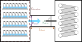

# Estimating Equipment Capability

The EC-CURT model, published by [Kazarin et al in 2021](https://doi.org/10.1208/s12249-021-02167-8), provides a compact way to get a first estimate of the equipment capability line. This equipment capability limit determines one edge of the design space for the primary drying stage of lyophilization. At a given pressure, this equipment limit is an upper bound on sublimation flux. In many cases, this limit is set by choked flow in the duct from the lyophilizer's main chamber to its condenser; this limit varies approximately linearly with pressure. 


The resulting line is given the form $m_\mathrm{flux} = k p_\mathrm{ch} + b$; the EC-CURT model returns the slope $k$ and intercept $b$, given the chamber volume, duct length, duct diameter, and valve thickness (within the duct), as shown in the schematic below. The parameters of this line are often given other names in literature; for example, in [the Python version of LyoPRONTO](https://lyopronto.geddes.rcac.purdue.edu) the slope is $b$ and the intercept is $a$.



The model was constructed by measuring equipment capability for 3 lyophilizers of varying size, validating CFD calculations with those measured limits, then doing CFD calculations on a 3x3x3x2 grid in the space of various lyophilizer dimensions: to evaluate on other lyophilizer geometries, a multilinear interpolation is used across this range of conditions. For full details, consult the article.
For some lyophilizers at some operating conditions, the condenser's capacity or flow effects around the condenser may be a stricter limitation; the EC-CURT model does not cover that regime.

## Close translation

A numerical implementation in MATLAB for the EC-CURT model was provided in the supplementary information of [the original article](https://doi.org/10.1208/s12249-021-02167-8). The CFD data (chamber pressures at all conditions) were translated from there into Julia and provided as part of LyoPronto.jl.

```@docs; canonical=false
ECCURT.eq_cap_line
ECCURT.eq_cap_pressure
```

The original implementation uses MATLAB `interpn` with the `spline` method, which does a quadratic interpolation on dimensions with 3 sample points and linear interpolation on dimensions with 2 sample points. This Julia implementation uses Interpolations.jl, which only allows linear interpolations, so it will not return numerically identical results to the original MATLAB implementation, but gives the same behavior.

Here is a comparison of points from the original to this implementation:

```@example ec
using LyoPronto, Plots
m_test = [0.1, 0.3, 0.5, 0.8]u"kg/hr"
D_t = 120u"mm"
vth_t = 50u"mm"
L_t = 300u"mm"
V_t = 0.092u"m^3"
p_validate = [45.6, 93.1, 140.5, 211.7]u"mTorr" # Taken directly from MATLAB results
# p_test = ECCURT.eq_cap_pressure.(m_test, D_t, vth_t, L_t, V_t) # This imitates the MATLAB API
line = ECCURT.eq_cap_line(D_t, vth_t, L_t, V_t) # This is the way you will usually use this model
p_test = (m_test .- line.b) ./ line.k # This is necessary because we are working from mass flow to get pressure
# To get mass flow from pressure:
# m_check = line.(p_test)
scatter(p_validate, m_test, marker=:o, label="Original MATLAB implementation")
plot!(p_test, m_test, label="Close translation")
```

## Newer application of same data

The original MATLAB implementation constructed lines by evaluating slope and intercept from the two higher mass flow rates at each geometry, neglecting the other two sampled points, and interpolating the slope and intercept values across lyophilizer geometries. To make full use of the reported data, we add a new implementation which interpolates the _pressures_ instead at all four mass flow rates, then regresses a new slope and intercept for the mass flow as a function of the interpolated pressures. 

This is provided via the function [`ECCURT.eq_cap_line_new`](@ref):

```@docs; canonical=false
ECCURT.eq_cap_line_new
```

The new interpolation is, for the most part, indistinguishable from the original approach, both of which match the base CFD data well. We can show this by examining at some of the original CFD conditions (`ECCURT.M_DOT`, `ECCURT.D_SAMPLE`, etc.), but you will generally not need to access these variables.

```@example ec
using Latexify # for making a nice plot
m_orig = ECCURT.M_DOT*u"kg/hr" # the underlying values 
vi = 1
v = ECCURT.VOLUME_SAMPLE[vi]
li = 2
l = ECCURT.L_SAMPLE[li]
plot(u"mTorr", u"kg/hr")
for (di, d) in enumerate(ECCURT.D_SAMPLE), (dai, da) in enumerate(ECCURT.DA_SAMPLE)
    c = di+(dai-1)*3 # color picker
    vt = d/da
    oldline = ECCURT.eq_cap_line(d, vt, l, v)
    newline = ECCURT.eq_cap_line_new(d, vt, l, v)
    pch = ECCURT.PCH[:,vi, di, dai, li]
    scatter!(pch, m_orig; c, marker=:utriangle, label="")
    plot!(pch, newline.(pch); c, linestyle=:dash, lw=3, label="")
    plot!(pch, oldline.(pch); c, marker=:dtriangle, lw=1, label="")
end
# Dummy series to make a common legend
scatter!([Inf], [Inf], c=:gray, marker=:utriangle, label="CFD")
plot!([Inf], [Inf], c=:gray, marker=:dtriangle, lw=1, label="Old interp")
plot!([Inf], [Inf], c=:gray, linestyle=:dash, lw=3, label="New interp")
# Last tinkering
plot!(xlabel="p_{ch}", ylabel="\\dot{m}", unitformat=latexify)
```

## Checking range of model parameters
Both [`ECCURT.eq_cap_line`](@ref) and [`ECCURT.eq_cap_line_new`](@ref) will emit a warning if the input lyophilizer geometry is outside the range of parameters with which this model was constructed. To programmatically check in advance whether a set of parameters is in range, the following function is provided:
```docs; canonical=false
ECCURT.is_in_model_range
```

The range of geometries for interpolation is:

|  | Lower limit | Upper limit |
|----|----|-----|
| Duct diameter | 59.6 mm | 304.8 mm |
| Ratio of duct diameter to valve thickness | 2.24 | 21.75
| Duct length | 100 mm | 890 mm |
| Chamber volume | 0.092 m$^3$ | 0.44 m$^3$ |

Outside of these ranges, the model uses linear extrapolation. This likely still yield useful results when the geometry of interest is only a little outside the range, but is not validated in the original study.